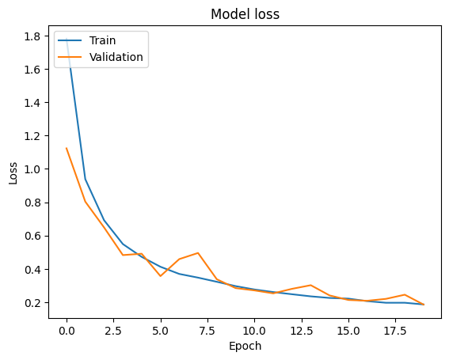
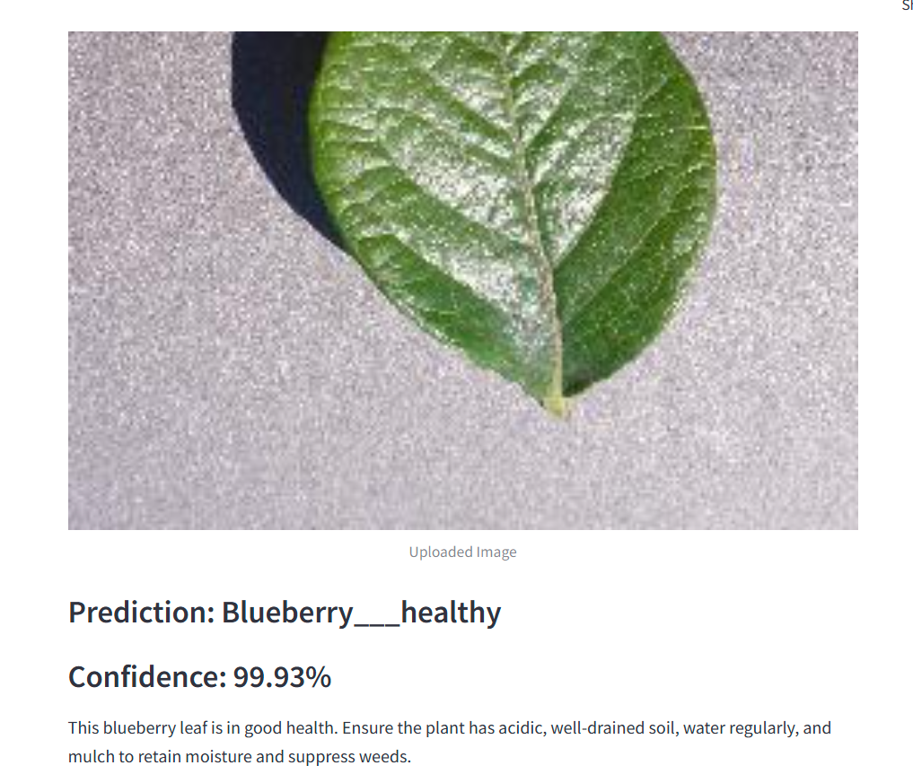

## 1. Title and Author
## Plant Disease Detection.
- Prepared for: UMBC Data Science Master Degree Capstone by Dr. Chaojie (Jay) Wang

- Author Name: Rashmini Akkapally

- GitHub Repository Link: [GitHub Repo](https://github.com/RashminiA6/UMBC-DATA606-Capstone)

- LinkedIn Profile Link: [LinkedIn Profile](https://www.linkedin.com/in/rashminiakkapally/)

- PowerPoint Presentation Link: [PowerPoint Presentation Link](https://github.com/RashminiA6/UMBC-DATA606-Capstone/blob/main/docs/finalppt.pptx)

- YouTube Video Link: [YouTube Video Link]

---

## 2. Background

### What is it about?  
This project aims to predict plant diseases using images of plant leaves and provide solutions or precautions for the detected disease. The solution will be delivered through a user-friendly web application built with Streamlit. Farmers or users will be able to upload images of plant leaves, and the machine learning model will predict whether the plant is healthy or affected by a disease. The app will also suggest possible solutions to the problem if the plant is diseased.

### Why does it matter?  
Plant diseases pose a significant threat to global agriculture, causing major crop losses and impacting food security, especially in farming-dependent regions. Early detection is essential to prevent the spread of disease and ensure healthier crops. This project uses machine learning to create an accessible and efficient tool for diagnosing plant diseases, enabling farmers to take quick and effective action. It is particularly useful for beginners in farming, providing them with an easy-to-use solution for managing crops. By offering a scalable, cost-effective method, the project aims to improve agricultural productivity, reduce economic losses, and support sustainable food production.

### What are your research questions?  
1. Can machine learning effectively classify healthy and diseased plant leaves using image data?  
2. What level of accuracy can be achieved using deep learning techniques such as Convolutional Neural Networks (CNNs)?  
3. What are the most effective image preprocessing techniques for enhancing the accuracy of plant disease detection?

---

## 3. Data

### Data sources  
- The PlantVillage Dataset, available on Kaggle:  
  [PlantVillage Dataset on Kaggle](https://www.kaggle.com/datasets/abdallahalidev/plantvillage-dataset?select=segmented)  
  This dataset consists of over 50,000 expertly curated images of healthy and diseased leaves from various crop plants.

### Data size  
- Approximately 2.18 GB

### Data shape  
- Number of images: 54,305 images  
- Image dimensions: 256x256 pixels

### Time period (if applicable)  
- N/A (static image dataset without time-based observations)

### What does each row represent?  
Each row represents a single image of a crop plant leaf, which is either healthy or affected by a specific disease.

### Data dictionary  

| Column Name | Data Type   | Definition                                                | Potential Values                                 |
|-------------|-------------|------------------------------------------------------------|--------------------------------------------------|
| Image       | Image       | The plant leaf image                                       | N/A                                              |
| Label       | Categorical | The type of disease affecting the plant or 'Healthy'       | 'Healthy', 'Early Blight', 'Late Blight', 'Leaf Mold', etc. |

### Which variable/column will be your target/label in your ML model?  
- The `Label` column, which indicates whether the leaf is healthy or diseased and, if diseased, specifies the type of disease.

### Which variables/columns may be selected as features/predictors for your ML models?  
- The primary feature is the image data itself. This will be processed using image classification techniques, such as Convolutional Neural Networks (CNNs), to extract relevant features automatically.

---

## 4. Exploratory Data Analysis (EDA)

### Data Extraction

The dataset used in this analysis is a compressed zip file (`plantvillage.zip`). It was unzipped using Python's `ZipFile` library and contains three main directories:

1. **Color**: RGB images of plant leaves.
2. **Grayscale**: Black-and-white versions of the images.
3. **Segmented**: Images with the background removed, leaving only the plant part.

Each folder contains subfolders representing different plant species and their associated diseases.

### Categories
The dataset is divided into **38 different plant leaf categories**, representing both healthy and diseased plant conditions. Each folder contains images of one type of leaf under a specific condition. The table below summarizes the number of images per category:

| **Category**                                   | **Number of Images** |
|------------------------------------------------|----------------------|
| Pepper, bell - healthy                         | 1478                 |
| Corn (maize) - Cercospora leaf spot / Gray leaf spot | 513            |
| Orange - Haunglongbing (Citrus greening)       | 5507                 |
| Tomato - Bacterial spot                        | 2127                 |
| Grape - Esca (Black Measles)                   | 1383                 |
| Apple - Black rot                              | 621                  |
| Tomato - healthy                               | 1591                 |
| Peach - Bacterial spot                         | 2297                 |
| Tomato - Tomato mosaic virus                   | 373                  |
| Cherry (including sour) - healthy              | 854                  |
| Tomato - Tomato Yellow Leaf Curl Virus         | 5357                 |
| Cherry (including sour) - Powdery mildew       | 1052                 |
| Blueberry - healthy                            | 1502                 |
| Potato - Late blight                           | 1000                 |
| Tomato - Spider mites / Two-spotted spider mite| 1676                 |
| Raspberry - healthy                            | 371                  |
| Peach - healthy                                | 360                  |
| Soybean - healthy                              | 5090                 |
| Grape - Leaf blight (Isariopsis Leaf Spot)     | 1076                 |
| Squash - Powdery mildew                        | 1835                 |
| Potato - Early blight                          | 1000                 |
| Corn (maize) - Northern Leaf Blight            | 985                  |
| Corn (maize) - Common rust                     | 1192                 |
| Grape - Black rot                              | 1180                 |
| Pepper, bell - Bacterial spot                  | 997                  |
| Grape - healthy                                | 423                  |
| Tomato - Septoria leaf spot                    | 1771                 |
| Tomato - Late blight                           | 1909                 |
| Tomato - Target Spot                           | 1404                 |
| Apple - Cedar apple rust                       | 275                  |
| Apple - healthy                                | 1645                 |
| Apple - Apple scab                             | 630                  |
| Strawberry - Leaf scorch                       | 1109                 |
| Tomato - Leaf Mold                             | 952                  |
| Potato - healthy                               | 152                  |
| Tomato - Early blight                          | 1000                 |
| Strawberry - healthy                           | 456                  |
| Corn (maize) - healthy                         | 1162                 |

## Data Visualization

### **Image Distribution by Category**
A bar plot was generated to visualize the distribution of images per category using Seaborn and Matplotlib.

 

### **Sample Images**
Some sample images from the dataset were displayed to provide a visual understanding of the data.

## Image Augmentation

To enhance the diversity of the training dataset and prevent overfitting, image augmentation was applied using the `ImageDataGenerator` from the Keras library. The augmentation techniques used include:

- **Rescaling**: Normalizes pixel values to a range of 0 to 1 (by dividing by 255).
- **Rotation**, **Shifting**, **Shearing**, and **Flipping**: Introduces variety in image positioning, zooming, and orientation to make the model more robust.

## Training and Validation Split

The dataset was split as follows:

- **Training set**: 80% of the images (43,456 images)
- **Validation set**: 20% of the images (10,849 images)

This split ensures that the model's performance is based on generalization rather than memorization.

## 5. Model Training

During the project, both a custom CNN model and a ResNet model were implemented and evaluated for plant disease detection.

### Development Environment

Used **Google Colab Pro** to leverage cloud-based GPUs for faster model training and **Visual Studio Code** as my primary coding environment for development of Streamlit web app.

## CNN Architecture

A Convolutional Neural Network (CNN) was built using the Keras library. The architecture consists of the following layers:

- **Convolutional Layers**: Extracts features from images by learning kernels that detect patterns like edges and textures.
- **MaxPooling Layers**: Reduces spatial dimensions (downsampling), making the network more efficient and resistant to overfitting.
- **Flatten Layer**: Converts 2D feature maps into 1D vectors.
- **Dense Layer**: A fully connected layer that learns complex representations from the extracted features.
- **Output Layer**: Uses a softmax activation function to output probabilities for the 38 classes.

### Model Compilation

The model was compiled using:

- **Optimizer**: Adam (chosen for its adaptive learning rate, which adjusts the step size based on gradient changes)
- **Loss Function**: Categorical Crossentropy (suitable for multi-class classification tasks)
- **Metrics**: Accuracy was used to monitor performance during training and validation.

### CNN Training Process

The model was trained using the `fit` method for 20 epochs. It utilized:

- **Training Data Generator**: `train_generator` for feeding batches of training images.
- **Validation Data Generator**: `val_generator` for monitoring validation performance.

During training, the model adjusted its weights to minimize the categorical crossentropy loss, improving its accuracy in classifying plant diseases. Validation accuracy and loss were tracked to ensure the model generalized well without overfitting.

### Training Details
	
- **Epochs**: 20
- **Training Time per Epoch**: ~200 seconds 
- **Final Training Accuracy**: 94.12%
- **Final Validation Accuracy**: 94.02%
- **Final Validation Loss**: 0.1857

- **Performance Improvements**:
  - Accuracy increased steadily for both training and validation sets.
  - Loss decreased, indicating effective learning.
  
### Performance Metrics Visualization for CNN

The training and validation accuracy and loss were plotted over the epochs using Matplotlib to monitor the model's learning behavior.

## ResNet Model Performance

### Training Details

- **Epochs**: 40
- **Training Time per Epoch**: ~259 seconds (ResNet is computationally intensive).
- **Final Training Accuracy**: 26.98%
- **Final Validation Accuracy**: 32.23%
- **Final Validation Loss**: 2.4347

### Performance Analysis

Although ResNet is a sophisticated architecture with residual connections designed to handle deeper networks, it struggled to achieve high accuracy in this project:

- **Validation Accuracy**: Peaked at 32.23%, which is significantly lower than the CNN model.
- **Loss**: The validation loss steadily improved but remained relatively high (2.43) compared to the CNN.

Given the superior accuracy and efficiency of the *CNN model*, it was chosen for deployment. However, the ResNet model provided valuable insights into the complexity of feature extraction and highlighted the importance of dataset suitability for deep architectures.

---
## 6. Application of the Trained Models

Built an user-friendly Web application using Streamlit, the app allows users to upload an image of a plant leaf. A Convolutional Neural Network (CNN) model then analyzes the image to predict the presence of any disease, providing a confidence score to indicate the reliability of the diagnosis. Beyond detection, the app offers customized care tips for each identified disease, equipping users with actionable steps to manage and protect their crops effectively. This dual-purpose functionality—combining disease detection with practical advice—makes the app a valuable resource for improving plant health and promoting sustainable agriculture.

 
---
## 7. Conclusion  

In conclusion, this project highlights how CNNs can be used effectively to detect plant diseases and assist in agriculture. The model’s high accuracy and ease of use make it a reliable tool for early disease detection, potentially reducing crop losses and supporting food security. The app’s design focuses on accessibility, making it an ideal solution for farmers and plant enthusiasts who need quick and reliable plant health assessments.

### Limitations
- **Dataset Constraints**: The model relies on the PlantVillage dataset, which may not cover all plant species or disease variations found in diverse agricultural settings.
- **Generalization Challenges**: Performance may vary under real-world conditions due to differences in image quality, lighting, and environmental factors.
- **Computational Demand**: More advanced models like ResNet, while sophisticated, demand significant computational resources and showed lower performance on this specific dataset compared to CNN.

### Lessons Learned
- **Data Quality Matters**: Effective deep learning models require high-quality, diverse datasets for reliable results.
- **Model Selection**: Simpler CNN architectures sometimes outperform deeper networks (like ResNet) when training data or computational resources are limited.
- **User-Centric Design**: Including an intuitive interface and actionable care recommendations increases the app's value, making it accessible for users with varied technical backgrounds.

### Future Research Directions
- **Dataset Expansion**: Broaden the dataset to include more plant species and disease types for better coverage and accuracy.
- **Model Optimization**: Enhance model efficiency for faster predictions, enabling mobile and offline deployment for real-time, field-ready assessments.
- **Large Language Model (LLM) Integration**: Integrate an LLM to provide users with a conversational interface, allowing them to ask questions, get disease explanations, and receive tailored plant care advice—turning the app into a comprehensive agricultural support tool.

---
## 8. References  

1. PlantVillage Dataset on Kaggle: [Link](https://www.kaggle.com/datasets/abdallahalidev/plantvillage-dataset?select=segmented)
2. Streamlit Documentation for Web Application Development: [Link](https://docs.streamlit.io/)
3. Hassan SM, Maji AK, Jasiński M, Leonowicz Z, Jasińska E. Identification of Plant-Leaf Diseases Using CNN and Transfer-Learning Approach. Electronics. 2021; 10(12):1388. https://doi.org/10.3390/electronics10121388
4. M. Shobana et al., "Plant Disease Detection Using Convolution Neural Network," 2022 International Conference on Computer Communication and Informatics (ICCCI), Coimbatore, India, 2022, pp. 1-5, doi: 10.1109/ICCCI54379.2022.9740975.
5. Web App Development Made Simple with Streamlit (2024) Google Books. Available at: https://books.google.com/books?id=pLfuEAAAQBAJ&dq=webapp+using+streamlit&lr=&source=gbs_navlinks_s.

Thankyou
~Rashmini Akkapally

